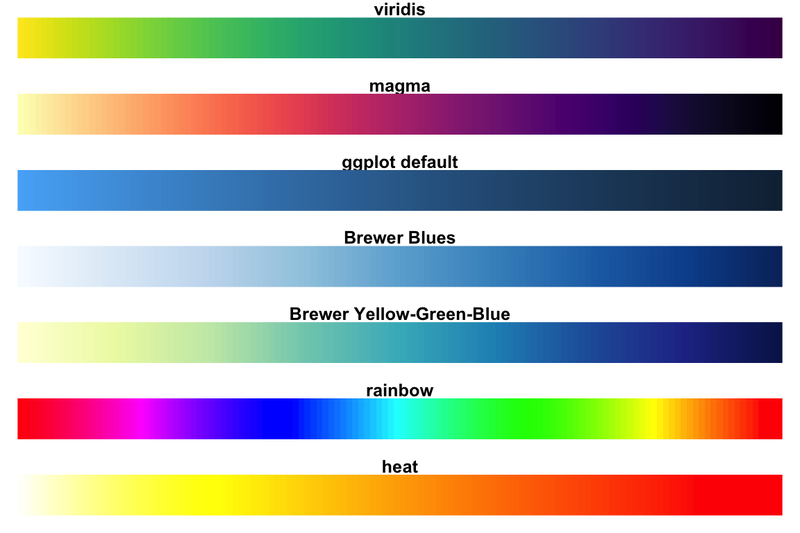

```{r setup, include = FALSE}
knitr::opts_chunk$set(
  collapse = TRUE,
  comment = "#>"
)
```

# General

The aim of the package `plot.matrix` is to visualize a matrix as is with a heatmap. Automatic reordering of rows and columns is only done if necessary. This is different as in similar function like ``heatmap``. Additionally it should be user-friendly and give access to a lot of options if necessary.

Currently the package implements the S3 functions below such that  you can use the generic `plot` function to plot matrices as heatmaps:

* `plot.matrix` for a heatmap for a plain matrix,
* `plot.loadings` for a heatmap for a loadings matrix from factor analysis or principal component analysis (reordering of rows!).

The plot itself is composed by a heatmap (usually left) where colors represent matrix entries and a key (usually right) which links the colors to the values.  

## First examples

```{r fig.height=4, fig.width=4}
library('plot.matrix')
# numeric matrix
x <- matrix(runif(35), ncol=5) # create a numeric matrix object
class(x)
par(mar=c(5.1, 4.1, 4.1, 4.1)) # adapt margins
plot(x)
# logical matrix
m <- matrix(runif(35)<0.5, ncol=7)
plot(m)
# text matrix
s <- matrix(sample(letters[1:10], 35, replace=TRUE), ncol=5)
plot(s)
```

```{r fig.height=5, fig.width=5}
library('plot.matrix')
library('psych')
data <- na.omit(bfi[,1:25])
fa <- fa(data, 5, rotate="varimax")
par(mar=c(5.1, 4.1, 4.1, 4.1)) # adapt margins
plot(loadings(fa), cex=0.5)
```

## Assigning colors and breaks

`plot.matrix` uses the command `assignColors`, also part of `plot.matrix`, assigns 
to each value in `x` a color based on the parameters `breaks`, `col` and `na.col` given.

In case of a numeric matrix `breaks` can be 

* a number, giving the number of intervals covering the range of `x`,
* a vector of two numbers, given the range to cover with 10 intervals, or
* a vector with more than two numbers, specify the interval borders

In case of a non-numeric vector `breaks` must contain all values which are
will get a color.
If `breaks` is not given then a sensible default is choosen: 
in case of a numeric vector derived from `pretty` and 
otherwise all unique values/levels are used.

`col` can be either be a vector of colors or a function which generates
via `col(n)` a set of `n` colors. The default is to use `heat.colors`.

## Choosing color palettes/functions

In case that you want to provide your own color palettes/functions for plotting there are several good choices 
within R packages:

<center>


Source: [Datanovia - Top R Color Palettes to Know for Great Data Visualization](https://www.datanovia.com/en/blog/top-r-color-palettes-to-know-for-great-data-visualization/)

</center>

* [`viridis`](https://CRAN.R-project.org/package=viridis) or [`viridisLite`](https://CRAN.R-project.org/package=viridisLite),
* [`RColorBrewer`](https://CRAN.R-project.org/package=RColorBrewer),
* [`ggplot2`](https://CRAN.R-project.org/package=ggplot2),
* [`ggsci`](https://CRAN.R-project.org/package=ggsci),
* [`wesanderson`](https://CRAN.R-project.org/package=wesanderson),

* [`cetcolor`](https://CRAN.R-project.org/package=cetcolor),
* [`colormap`](https://CRAN.R-project.org/package=colormap),
* [`ColorPalette`](https://CRAN.R-project.org/package=ColorPalette),
* [`colorr`](https://CRAN.R-project.org/package=colorr),
* [`colorRamps`](https://CRAN.R-project.org/package=colorRamps),
* [`dichromat`](https://CRAN.R-project.org/package=dichromat),
* [`jcolors`](https://CRAN.R-project.org/package=jcolors),
* [`morgenstemning`](https://CRAN.R-project.org/package=morgenstemning),
* [`painter`](https://CRAN.R-project.org/package=painter),
* [`paletteer`](https://CRAN.R-project.org/package=paletteer),
* [`pals`](https://CRAN.R-project.org/package=pals),
* [`Polychrome`](https://CRAN.R-project.org/package=Polychrome),
* [`qualpalr`](https://CRAN.R-project.org/package=qualpalr),
* [`randomcoloR`](https://CRAN.R-project.org/package=randomcoloR), or
* [`Redmonder`](https://CRAN.R-project.org/package=Redmonder).

## Structure of the plot

The plot is created in several steps

1. a call to the `plot` command to create the basic plot
2. draw colored polygons for each matrix entry with the `polygon` command 
3. if necessary add the value of each matrix entry with the `text` command in a polygon
4. if necessary draw x- and y-axis with the `axis` command into the plot
5. if necessary draw the key with the `axis` and the `polygon` command 

## Formal parameters

```{r echo=FALSE}
p   <-formals(plot.matrix:::plot.matrix)
p$na.col <- paste0('"', p$na.col, '"')
out <- matrix('', nrow=length(p), ncol=4)
out[1,1] <- 'plot.matrix('
out[,2] <- names(p)
cp  <- as.character(p)
ct  <- (cp!='')
out[ct,3] <- '=' 
out[ct,4] <- cp[ct] 
out[1:length(p),4] <- cp
out[1,2] <- paste0(out[1,2], ',')
out[2:(length(p)-1),4] <- paste0(out[2:(length(p)-1),4], ',')
out[length(p),2] <- paste0(out[length(p),2], ')')
#out <- cbind(out[,1], apply(out[,2:5], 1, function(e) paste0(e, collapse="")))
knitr::kable(out)
```

You may influence the appearance by setting your own parameters:

1. `...` all parameters given here will be given to the `plot` command, e.g. `xlab`, `ylab`, ....
2. `polygon.cell` list of parameters for drawing polygons for matrix entries
3. `text.cell` list of parameters for putting for matrix entries as texts
4. `axis.col` and `axis.row` list of parameters for drawing for row and column axes
5. `key`, `axis.key` and `polygon.key` to draw the key
6. `max.col` to determine when text color and background color to near

## Set global parameters

You may set global parameters for all subsequent calls of `axis`, `polygon` and `text` via the `...`. The following parameters are supported

function  | parameter(s)
----------|----------------------------------------------------------------------
`axis`    | `cex.axis`, `col.axis`, `col.ticks`, `font`, `font.axis`, `hadj`, `las`, `lwd.ticks`, `line` , `outer`, `padj`, `tck`, `tcl`, `tick`                  
`polygon` | `angle`, `border`, `density`
`text`    | `cex`, `font`, `vfont`


```{r fig.height=4, fig.width=4}
par(mar=c(5.1, 4.1, 4.1, 4.1)) # adapt margins
# omit all borders
plot(x, border=NA)
```

# Frequently asked questions

* __How can I delete the grid lines?__
: Use the parameter `border=NA`.

# Modifying a plot

## Defaults

The default plot always draws a heatmap and a key where the colors and breaks are determined by the entries of `x`. In case of a numeric matrix ten colors from `heat.colors` are chosen and eleven breaks with cover the range of entries with an equidistant grid. In case of a non-numeric matrix each unique element gets a color determined from `heat.colors`.

## Modifying the breaks

In case of a numeric matrix the `breaks` give the interval borders for a color otherwise for each unique matrix entry `breaks` should contain a value. If `breaks` are not given then they will be determined from the matrix object by using the `pretty` function of base R.

```{r fig.height=4, fig.width=4}
par(mar=c(5.1, 4.1, 4.1, 4.1))   # adapt margins
# we only want the range of x
plot(x, breaks=range(x))     
# we want seven colors
plot(x, breaks=7)  
# user defined breaks, out-of-range entries are colored white
plot(x, breaks=c(0.3,0.5,0.8))  
```

## Modifying the colors

### Cell colors

The `col` parameter is either a vector of colors used or a function `mycolor(n)` which returns `n` colors on request. 

```{r fig.height=4, fig.width=4}
par(mar=c(5.1, 4.1, 4.1, 4.1))   # adapt margins
# use a color function
plot(x, col=topo.colors)
# user defined breaks and colors
plot(x, col=c('red', 'green'), breaks=c(0, 0.5, 1))   
# non-numeric matrix
# assign colors
plot(m, col=c('red', 'green'))
# assign colors and breaks directly 
plot(m, col=c('red', 'green'), breaks=c(TRUE, FALSE))
```

Note that for numeric matrices must hold `length(breaks)==length(col)+1` and for non-numeric matrices  `length(breaks)==length(col)`.

### Missing values and out-of-range matrix entries

The parameter `na.col` determines the color for missing values and for matrix entries outside the current color scheme.

```{r fig.height=4, fig.width=4}
par(mar=c(5.1, 4.1, 4.1, 4.1))   # adapt margins
x[1,1] <- NA
plot(x, col=topo.colors)
plot(x, col=topo.colors, na.col="red")
plot(s, col=topo.colors, breaks=c('a', 'c', 'e', 'g', 'i'))
```

## Modifying the key

### Delete the key

For deleting the key set `key=NULL`: 

```{r fig.height=4, fig.width=4}
par(mar=c(5.1, 4.1, 4.1, 4.1))   # adapt margins
# delete key
plot(x, key=NULL)
```

### Move the key 

For moving the key to a different axis use `key` or `axis.key`. Note that only a warning is issued if the axes
for rows, columns or the key are at the same side.

```{r fig.height=4, fig.width=4}
par(mar=c(5.1, 4.1, 5.1, 4.1))   # adapt margins
# move key to the top and make axis text smaller
plot(x, key=list(side=3, cex.axis=0.75), breaks=c(0,1))
```

### Change the output format of the key labels 

You can either use `digits` which changes the output format for all text. If you just want to change the output format for the key labels use `fmt.key`, e.g. 

```{r fig.height=4, fig.width=4}
par(mar=c(5.1, 4.1, 4.1, 4.1))   # adapt margins
# no plus sign
plot(x, fmt.key="%.3f", breaks=c(0,1))
```

For details to the format string see `sprintf`, for non-numeric matrices `%s` should be used.

***Warning: The format string is passed down the OS's sprintf function, and incorrect formats can cause the latter to crash the R process. R does perform sanity checks on the format, but not all possible user errors on all platforms have been tested, and some might be terminal.***

## Modifying the row and column axes

As default the row axis is drawan as y-axis and the col axis is drawn as x-axis with row and column indices.
If the matrix has `rownames(x)` or `colnames(x)` then they will used. The same holds for the labels of the axes if `names(dimnames(x))`is not empty.

```{r fig.height=4, fig.width=4}
par(mar=c(5.1, 4.1, 4.1, 4.1))   # adapt margins
plot(x, xlab="my x label", ylab="my y label")
# The HairEyeColor has its own names
tab <- apply(HairEyeColor,1:2, sum)
plot(tab)
```

For moving, e.g. the column axis to the top, use 

```{r fig.height=4, fig.width=4}
par(mar=c(5.1, 4.1, 5.1, 4.1))   # adapt margins
plot(x, axis.col=list(side=3, cex.axis=0.7), axis.row=list(cex.axis=0.7))
# or alternatively set cex.axis for all axes and use abbreviated positioning
plot(x, axis.col=3, cex.axis=0.7)
```

For not drawing any axes use

```{r fig.height=4, fig.width=4}
par(mar=c(5.1, 4.1, 4.1, 4.1))   # adapt margins
plot(x, axis.col=NULL, axis.row=NULL, xlab='', ylab='')
```

## Show matrix entries

You can either use `digits` which changes the output format for all text. If you just want to change the output format for the key labels use `fmt.cell`, e.g. 

```{r fig.height=4, fig.width=4}
par(mar=c(5.1, 4.1, 4.1, 4.1))   # adapt margins
# change all text output
plot(x, digits=4, text.cell=list(cex=0.5))
# of alternatively use the global parameter cex
plot(x, digits=4, cex=0.5)
# change just matrix entries (no plus sign)
plot(x, fmt.cell='%.2f')
```

## `NA` handling 

Usually `NA` values in a matrix are drawn as white boxes which determined by the value of 
the `na.col` parameter (default: white) and if the matrix entries shown by `NA

```{r fig.height=4, fig.width=4}
x <- matrix(c(NA, 1, 2, 3), ncol=2)
par(mar=c(5.1, 4.1, 4.1, 4.1))   # adapt margins
plot(x, na.col='black', fmt.cell='%.0f')
```

You may enforce with `na.print` no printing of `NA`s or using a replacement text

```{r fig.height=4, fig.width=4}
x <- matrix(c(NA, 1, 2, 3), ncol=2)
par(mar=c(5.1, 4.1, 4.1, 4.1))   # adapt margins
plot(x, na.col='black', fmt.cell='%.0f', na.print=FALSE)
plot(x, na.col='black', fmt.cell='%.0f', na.print='Missing')
```

With `na.cell` you suppress printing of matrix entries at all

```{r fig.height=4, fig.width=4}
x <- matrix(c(NA, 1, 2, 3), ncol=2)
par(mar=c(5.1, 4.1, 4.1, 4.1))   # adapt margins
plot(x, fmt.cell='%.0f', na.cell=FALSE)
```

## Automatic text color adjustment

It may happen that the text color and cell background color are [too near](https://en.wikipedia.org/wiki/Color_difference#Euclidean) which means you can not read the text anymore in a cell

```{r fig.height=4, fig.width=4}
par(mar=c(5.1, 4.1, 4.1, 4.1))   # adapt margins
# Never replace text color by black or white
plot(x, digits=2, text.cell=list(col="yellow", cex=0.75), max.col=-1) 
```

By default the text color is replaced by black or white (which is [farer  away](https://en.wikipedia.org/wiki/Color_difference#Euclidean))

```{r fig.height=4, fig.width=4}
par(mar=c(5.1, 4.1, 4.1, 4.1))   # adapt margins
plot(x, digits=2, text.cell=list(col="yellow", cex=0.75)) 
```

Just replace text color if colors are nearer then the default `max.col=70` 

```{r fig.height=4, fig.width=4}
par(mar=c(5.1, 4.1, 4.1, 4.1))   # adapt margins
# In fewer cells the text color will be replaced by black
plot(x, digits=2, text.cell=list(col="yellow", cex=0.75), max.col=35) 
```

or farer away then the default

```{r fig.height=4, fig.width=4}
par(mar=c(5.1, 4.1, 4.1, 4.1))   # adapt margins
# In more cells the text color will be replaced by black
plot(x, digits=2, text.cell=list(col="yellow", cex=0.75), max.col=140) 
```

Of course, the best solution is to choose a good color scheme and a good text color ;)

## Information about drawn elements 

The `plot` command returns invisibly a list of the elements drawn, a bit like `hist`. A `NULL` entry means the element has not been drawn. The data may be useful for adding own elements in the graphic.

```{r fig.height=4, fig.width=4}
# numeric matrix
x <- matrix(runif(35), ncol=5) # create a numeric matrix object
par(mar=c(5.1, 4.1, 4.1, 4.1)) # adapt margins
res <- plot(x)
```

Available are the parameters for

* `cell.polygon`, `cell.text`: the polygon and the text used to draw a matrix element,
* `key.polygon`, `key.axis`: the polygon and the axis used to draw a key element, and
* `plot`, `axis.col`, `axis.row`: the basic plot and the axes drawn.

```{r}
#####
names(res)
# parameters of polygon which was used to draw x[3,4]
res$cell.polygon[[3,4]]
#####
# parameters of text which was used for x[3,4]
res$cell.text[[3,4]]  # NULL since no text was drawn
#####
# parameters of polygon which was used to draw the second key element
res$key.polygon[[2]]  
```

# Plotting special matrices

For some special matrices we have special plot routines:

* loadings of a factor analysis or principal component analysis: `plot.loadings`
* correlations: `plot.cor`
* associations: `plot.assoc`
* p values: `plot.pvalue`

All plot routines support the parameters

* `gray` and `grey` for gray scale image 
* `reorder` for reordering rows (default: `reorder=TRUE`)

Note that matrix columns are only reordered if the column names are identical to the row names.

## Loadings matrix

In factor or principal component analysis you may want to view the loadings matrix. The S3 function `plot.loadings` allows to create a heatmap with loadings. It differs from plotting a matrix by

* the color key ranges from -1 to 1,
* the breaks are set to `c(-sqrt(c(1, 0.75, 0.5, 0.25, 0.16)), 0, sqrt(c(1, 0.75, 0.5, 0.25, 0.16)))`,
* the matrix rows, corresponding to the variables, are reordered (according to the breaks),
* the matrix entries are printed with two digits after the comma.

A typical threshold in factor analysis is an absolute loading greater equal 0.5; thus a factor "explains" 25% of the variance of a variable. Further thresholds are selected such that they explain 50% and 75% of the variable variance. Sometimes it might be useful to check whether there are loadings a little bit under 0.5, therefore another threshold of 0.4 is added.

All parameters described in **Modifying a plot** can be used in `plot.loadings` as well.

```{r fig.height=5, fig.width=5}
library('plot.matrix')
library('psych')
data(bfi.2)
fa <- fa(bfi.2, 5, rotate="varimax")
par(mar=c(5.1, 4.1, 4.1, 4.1)) # adapt margins
plot(loadings(fa), cex=0.5)
```

### Gray scale

For using a gray color scheme add `gray=TRUE`or `grey=TRUE` to the call

```{r fig.height=5, fig.width=5}
library('plot.matrix')
library('psych')
data(bfi.2)
fa <- fa(bfi.2, 5, rotate="varimax")
par(mar=c(5.1, 4.1, 4.1, 4.1)) # adapt margins
plot(loadings(fa), cex=0.5, gray=TRUE)
```

### No matrix entries

For not printing loading entries use the parameter `digits`: 

```{r fig.height=5, fig.width=5}
library('plot.matrix')
library('psych')
data(bfi.2)
fa <- fa(bfi.2, 5, rotate="varimax")
par(mar=c(5.1, 4.1, 4.1, 4.1)) # adapt margins
plot(loadings(fa), digits=NA)
```

### No reordering of rows

For not reordering the variables use the parameter `reorder`: 

```{r fig.height=5, fig.width=5}
library('plot.matrix')
library('psych')
data(bfi.2)
fa <- fa(bfi.2, 5, rotate="varimax")
par(mar=c(5.1, 4.1, 4.1, 4.1)) # adapt margins
plot(loadings(fa), reorder=FALSE, cex=0.5)
```

## Correlations and associations

The S3 function `plot.cor` and `plot.assoc`  allow to create a heatmap with the coefficients. It differs from plotting a matrix by

* the color key ranges from -1 to 1 for correlations and 0 to 1 for associations,
* the breaks are set to reflect the effect sizes given by Cohen
* the matrix rows, corresponding to the variables, are reordered using `dist` and `hclust` with the defaults on the rows, 
* the matrix entries are printed with two digits after the comma.

All parameters described in **Modifying a plot** can be used in `plot.assoc` or `plot.cor` as well.

```{r fig.height=5, fig.width=5}
library('plot.matrix')
data(Titanic.cramer)
par(mar=c(5.1, 4.1, 4.1, 4.1)) # adapt margins
plot(as.assoc(Titanic.cramer))
```

```{r fig.height=5, fig.width=5}
library('plot.matrix')
library('datasets')
c <- cor(airquality[,1:4], use="complete")
par(mar=c(5.1, 4.1, 4.1, 4.1)) # adapt margins
plot(as.cor(c))
```

### Gray scale

For using a gray color scheme add `gray=TRUE`or `grey=TRUE` to the call

```{r fig.height=5, fig.width=5}
library('plot.matrix')
data(Titanic.cramer)
par(mar=c(5.1, 4.1, 4.1, 4.1)) # adapt margins
plot(as.assoc(Titanic.cramer), gray=TRUE)
```

### No matrix entries

For not printing loading entries use the parameter `digits`: 

```{r fig.height=5, fig.width=5}
library('plot.matrix')
data(Titanic.cramer)
par(mar=c(5.1, 4.1, 4.1, 4.1)) # adapt margins
plot(as.assoc(Titanic.cramer), digits=NA)
```

### No reordering of rows

For not reordering the variables use the parameter `reorder`: 

```{r fig.height=5, fig.width=5}
library('plot.matrix')
data(Titanic.cramer)
par(mar=c(5.1, 4.1, 4.1, 4.1)) # adapt margins
plot(as.assoc(Titanic.cramer), reorder=FALSE)
```

## P values

The S3 function `plot.pvalue` allows to create a heatmap from a matrix of p values. It differs from plotting a matrix by

* the color key ranges from  0 to 1 
* the breaks are set to 0, 0.1, 0.05, 0.01, 0.001 and 1
* the matrix rows, corresponding to the variables, are reordered using `dist` and `hclust` with the defaults on the rows, 
* the matrix entries are printed with three digits after the comma.

All parameters described in **Modifying a plot** can be used in `plot.pvalue` as well.

```{r fig.height=5, fig.width=5}
library('plot.matrix')
data(air.pvalue)
par(mar=c(5.1, 4.1, 4.1, 4.1)) # adapt margins
plot(as.pvalue(air.pvalue))
```

### Gray scale

For using a gray color scheme add `gray=TRUE`or `grey=TRUE` to the call

```{r fig.height=5, fig.width=5}
library('plot.matrix')
data(air.pvalue)
par(mar=c(5.1, 4.1, 4.1, 4.1)) # adapt margins
plot(as.pvalue(air.pvalue), gray=TRUE)
```

### No matrix entries

For not printing loading entries use the parameter `digits`: 

```{r fig.height=5, fig.width=5}
library('plot.matrix')
data(air.pvalue)
par(mar=c(5.1, 4.1, 4.1, 4.1)) # adapt margins
plot(as.pvalue(air.pvalue), digits=NA)
```

### No reordering of rows

For not reordering the variables use the parameter `reorder`: 

```{r fig.height=5, fig.width=5}
library('plot.matrix')
data(air.pvalue)
par(mar=c(5.1, 4.1, 4.1, 4.1)) # adapt margins
plot(as.pvalue(air.pvalue), reorder=FALSE)
```

